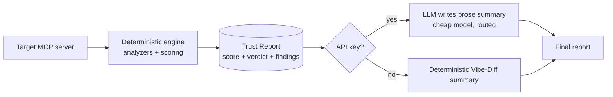
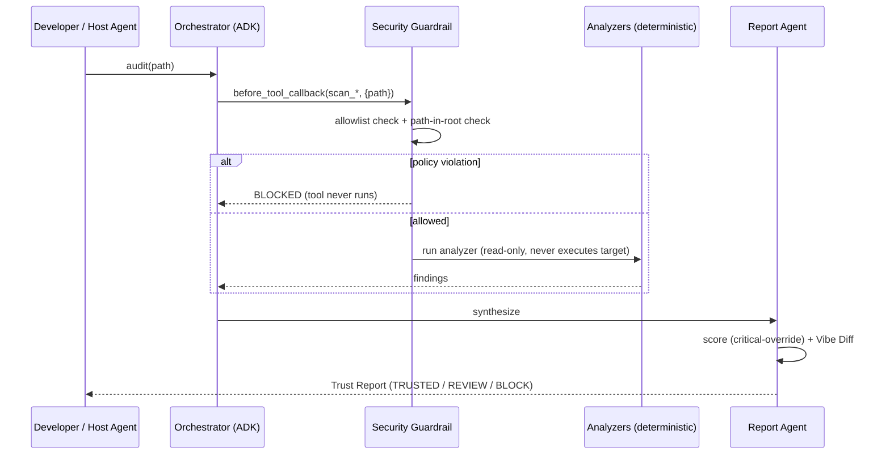

# MCPTrust — Architecture

## 1. Design philosophy: deterministic core, LLM decoration

MCPTrust follows the Day 1 *agentic-engineering* discipline: the **harness is the
source of truth**, the model decorates it.



The score and verdict are **never** produced by a model — only the prose summary
is. This makes the verdict reproducible (needed for a security gate), keeps the
product working with zero API keys, and means a prompt injection in a *target*
can never change MCPTrust's own verdict.

## 2. The audit sequence



## 3. Security architecture (maps to Day 4's 7 pillars)

| Pillar | MCPTrust implementation |
|---|---|
| Infra / sandboxing | Read-only ingest; target is never imported/executed. `MCPTRUST_ALLOWED_ROOT` bounds readable paths. |
| Data | Evidence is redacted before it enters a report (no secret ever echoed). |
| Model | LLM sees only a findings list; it cannot change the score/verdict. |
| App / runtime | Policy-Server `before_tool_callback` gate on every tool call. |
| IAM | Zero Ambient Authority: file-tree allowlist rejects traversal/absolute escapes. |
| SecOps / observability | Every finding carries analyzer + location + severity for audit. |
| Governance | Eval gate (corpus + labels) blocks regressions in CI; self-audit dogfoods the rules. |

## 4. Scoring model

```
score = 100 - Σ min(per_class_penalty, PER_CLASS_CAP)      (clamped 0..100)
verdict = BLOCK if any CRITICAL finding
        else TRUSTED (≥80) / REVIEW (50–79) / BLOCK (<50)
```

- **Per-class cap (45):** stops one noisy category (e.g. 40 unpinned deps) from
  dominating the verdict.
- **Critical-override:** a single CRITICAL finding forces BLOCK regardless of
  score — the gate behaves conservatively on purpose.

## 5. Deployment paths (Deployability)

1. **Local CLI** — `pip install -e .` then `mcptrust audit`.
2. **MCP server** — `python -m mcptrust.mcp_server.server`; register with a host
   agent so it audits servers before install.
3. **CI gate (Day 5 Tier-2)** — `.github/workflows/audit.yml` runs the eval gate
   and a self-audit on every push; a `BLOCK` fails the build.
4. **Agents CLI / Cloud Run** — the deterministic engine is a pure function and
   the MCP server is a standard stdio server, so it packages into a container and
   deploys via `agents-cli deploy` (or `gcloud run deploy`) with no code changes.

## 6. Extensibility

Adding a new threat class is *a new analyzer file + a registry entry + a skill
folder + corpus samples + labels* — no changes to scoring, agents, CLI, or the
MCP server. The 4th detector is a new folder, not a new deployment (Day 3's
logistics argument).
